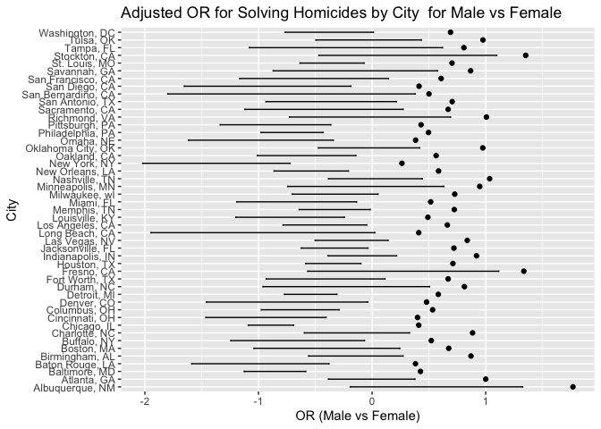

p8105_hw6_ek3376
================
ek3376
2024-12-02

``` r
library(tidyverse)
```

    ## ── Attaching core tidyverse packages ──────────────────────── tidyverse 2.0.0 ──
    ## ✔ dplyr     1.1.4     ✔ readr     2.1.5
    ## ✔ forcats   1.0.0     ✔ stringr   1.5.1
    ## ✔ ggplot2   3.5.1     ✔ tibble    3.2.1
    ## ✔ lubridate 1.9.3     ✔ tidyr     1.3.1
    ## ✔ purrr     1.0.2     
    ## ── Conflicts ────────────────────────────────────────── tidyverse_conflicts() ──
    ## ✖ dplyr::filter() masks stats::filter()
    ## ✖ dplyr::lag()    masks stats::lag()
    ## ℹ Use the conflicted package (<http://conflicted.r-lib.org/>) to force all conflicts to become errors

``` r
library(rvest)
```

    ## 
    ## Attaching package: 'rvest'
    ## 
    ## The following object is masked from 'package:readr':
    ## 
    ##     guess_encoding

## **Problem 2**

Below we import the Washington Post data on homicides in 59 large U.S.
cities. We then added a city_state variable and a binary variable
indicating whether the homicide is solved. From this dataset, we omitted
cities that don’t report victim race or have a data entry mistake,
changed victim_age to be numeric, and limited our analysis the those for
whom victim_race is white or black.

``` r
washingtonpost_url = "https://raw.githubusercontent.com/washingtonpost/data-homicides/master/homicide-data.csv"

wp_homicide = read_csv(washingtonpost_url)
```

    ## Rows: 52179 Columns: 12
    ## ── Column specification ────────────────────────────────────────────────────────
    ## Delimiter: ","
    ## chr (9): uid, victim_last, victim_first, victim_race, victim_age, victim_sex...
    ## dbl (3): reported_date, lat, lon
    ## 
    ## ℹ Use `spec()` to retrieve the full column specification for this data.
    ## ℹ Specify the column types or set `show_col_types = FALSE` to quiet this message.

``` r
wp_homicide_data = wp_homicide |>
  mutate(city_state = str_c(city, ", ", state)) |>
  mutate(solved_homicides = ifelse(disposition == "Closed by arrest", 1, 0)) |>
  filter(!(city_state %in% c("Dallas, TX", "Phoenix, AZ", "Kansas City, MO", "Tulsa, AL"))) |>
  filter(
    victim_race %in% c("White", "Black")) |>
  mutate(victim_age = as.numeric(ifelse(victim_age == "unknown", NA, victim_age)))
```

    ## Warning: There was 1 warning in `mutate()`.
    ## ℹ In argument: `victim_age = as.numeric(ifelse(victim_age == "unknown", NA,
    ##   victim_age))`.
    ## Caused by warning:
    ## ! NAs introduced by coercion

Below, we use a glm function to fit a logistic regression with resolved
vs unresolved as the outcome and victim age, sex, and race as predictors
for the city of Baltimore, MD.

``` r
baltimore_data = wp_homicide_data |>
  filter(city_state == "Baltimore, MD",
         !is.na(victim_race), 
         !is.na(victim_age),
         !is.na(victim_sex),
         !is.na(solved_homicides)
  )

baltimore_model = glm(
  solved_homicides ~ victim_age  + victim_sex + victim_race, family = binomial, data = baltimore_data
)

baltimore_results = baltimore_model |>
  broom::tidy(conf.int = TRUE) |>
  mutate(
    OR = exp(estimate)) |>
  select(term, log_OR = estimate, OR, conf.low, conf.high, p.value) |>
  knitr::kable(digits = 3)

baltimore_results
```

| term             | log_OR |    OR | conf.low | conf.high | p.value |
|:-----------------|-------:|------:|---------:|----------:|--------:|
| (Intercept)      |  0.310 | 1.363 |   -0.025 |     0.648 |   0.070 |
| victim_age       | -0.007 | 0.993 |   -0.013 |     0.000 |   0.043 |
| victim_sexMale   | -0.854 | 0.426 |   -1.126 |    -0.584 |   0.000 |
| victim_raceWhite |  0.842 | 2.320 |    0.501 |     1.187 |   0.000 |

Below we run a glm for each city in the dataset, and extract the
adjusted odds ratio and CI for solving homicides comparing male and
female victims. We then create a plot that shows the estimated ORs and
CIs for each city and oragnize cities according to estiamte OR.

``` r
city_results = wp_homicide_data |>
  group_by(city_state) |>
  nest() |>
  mutate(
    model = map(data, ~ glm(solved_homicides ~ victim_age + victim_sex + victim_race, family = binomial, data = .)),
    results = map(model, broom::tidy, conf.int = TRUE)
  ) |>
  unnest(results) |>
  mutate(
    OR = exp(estimate),
    log_OR = estimate
  ) |>
  select(city_state, term, log_OR, OR, conf.low, conf.high, p.value)
```

    ## Warning: There were 44 warnings in `mutate()`.
    ## The first warning was:
    ## ℹ In argument: `results = map(model, broom::tidy, conf.int = TRUE)`.
    ## ℹ In group 1: `city_state = "Albuquerque, NM"`.
    ## Caused by warning:
    ## ! glm.fit: fitted probabilities numerically 0 or 1 occurred
    ## ℹ Run `dplyr::last_dplyr_warnings()` to see the 43 remaining warnings.

``` r
city_results_plot = city_results |>
  filter(term == "victim_sexMale") |>
  mutate(city_state = factor(city_state, levels = city_state)) |>
  arrange(OR) |>
  ggplot(aes(x = OR, y = city_state)) + 
  geom_point() +
  geom_errorbarh(aes(xmin = conf.low, xmax = conf.high), height = 0.2) + 
  labs(
    title = "Adjusted OR for Solving Homicides by City  for Male vs Female", x = "OR (Male vs Female)", y = "City"
  )

city_results_plot
```

<!-- -->
